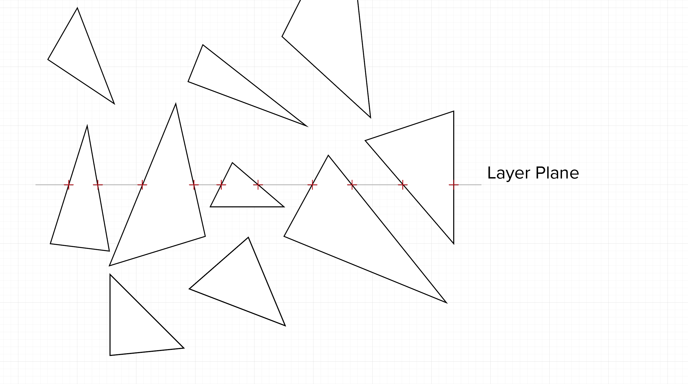
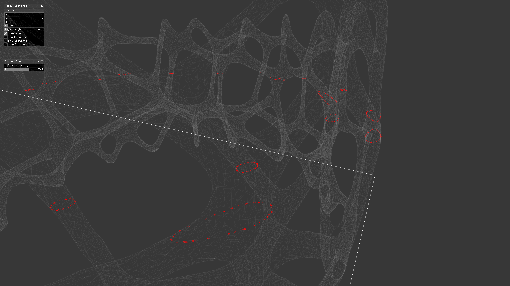

# ofxSlicer

A slicer for doing parallel processing in additive manufacturing. Currently under heavy development

## The Slicer

The algorithms behind the slicer is mostly motivated by the work presented in this [paper.](http://www.dainf.ct.utfpr.edu.br/%7Emurilo/public/CAD-slicing.pdf) In the paper, the authors claims that they have developed a slicing algorithm that is time-wise optimal compared to other slicing algorithms known in litterature.

The slicing algorithm goes something like this:

1. Create a list containing all triangles of the mesh model.
2. Mesh slicing:  Calculate triangle intersection points on each plane.
3. Construct contours: Create polygons from the intersection points
4. Make sence of the polygons (Clockwice/Counterclockwise)

Full disclaimer. I´m new to C++, and by no means an expert in programming. I wanted to keep close track on how the memory is used and allocated by the slicer. Based on this I decided that C++ would be an optimal choise of language.  I´m also having a really alright time with Openframeworks. 

### Getting the triangles 

Getting the triangles was a bit of a struggle in Openframeworks. To import .stl files, I use the [ofxAssimpModelLoader](http://openframeworks.cc/documentation/ofxAssimpModelLoader/ofxAssimpModelLoader/) addon in openframeworks.  It took some tweaking to get the triangle faces, with it´s belonging vertices, extracted from the assimp class. All the triangles are sorted in ascending order in terms of the lowest point in the triangle. I´ve commented this in the code. NOTE: It would probaly be easier to use some kind of existing C++ framework for geometry like CGAL, but not as much fun! 

### Calculate the triangle intersections 

Once we have the triangles it´s time to calculate the intersection points on each layer. 

TODO: post seudo code. 

We basically have three diferent situations. 
1. The triangle is located on the topside of the layer plane 
2. The triangle is intersecting with the plane. 
3. The triangle is underneath the plane. This means that the slicer is finished processing it. 

TODO: Remove finished triangles. This will speed up the algorithm and save time on more complex geometry. 

### Creating the toolpaths

TODO: Build toolpaths. Are you doing .gcode? 

### Threading in C++

### How to use it
Explain how people can reuse the slicer. 

### How I use it
##
