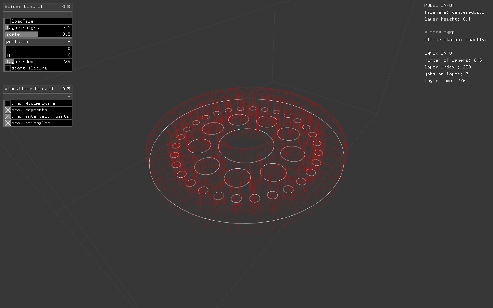

# ofxSlicer

Slices mesh geometry into layers consisting of curves. Written in c++ as an addon for Openframeworks. Currently missing any form of infill strategy and .gcode generation. 

## The Slicer

The slicing algorithm goes something like this:

1. Create a list containing all triangles of the mesh model.
2. Mesh slicing:  Calculate triangle intersection points on each plane.
3. Construct contours: Create polygons from the intersection points for each plane.
4. Make sence of the polygons (Clockwice/Counterclockwise)

Full disclaimer. I´m new to C++, and by no means an expert in programming. I wanted to keep close track on how the memory is used and allocated by the slicer. Based on this I decided that C++ would be an optimal choise of language.  I´m also having a really alright time with Openframeworks. 

### Getting the triangles 

Getting the triangles was a bit of a struggle in Openframeworks. To import .stl files, I use the [ofxAssimpModelLoader](http://openframeworks.cc/documentation/ofxAssimpModelLoader/ofxAssimpModelLoader/) addon in openframeworks.  It took some tweaking to get the triangle faces, with it´s belonging vertices extracted from the assimp class. All the triangles are sorted in ascending order in terms of the lowest point in the triangle. I have commented this in the code. NOTE: It would probaly be easier to use some kind of existing C++ framework for geometry like CGAL

### Calculate the triangle intersections 

Once we have the triangles it´s time to calculate the intersection points on each layer. Have a look at this figure. 

I basically have three diferent situations. 
1. The triangle is located on the topside of the layer plane 
2. The triangle is intersecting with the plane. 
3. The triangle is underneath the plane. This means that the slicer is finished processing it. 

### Active triangles 

To improve the speed of the algorithm the triangles that are finished processed are removed from the triangle list that is used in the calculation. This condition applies when the entire triangle is located underneath the layer plane. See figure. 

### Generate Polygons 

TODO: Come back and explain this 

### How you can use it
Reusing the slicer in your Openframeworks project should be pretty straightforward. 
* clone the git into your local addons folder
* use the Openframeworks projectGenerator to include the ofxSlicer in your project 
* create an ofxSlicer object, feed it an stl and start slicing. Do a debug if your want to study how the data is structured. 

##
